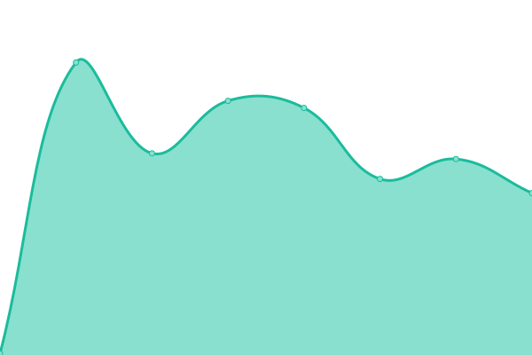
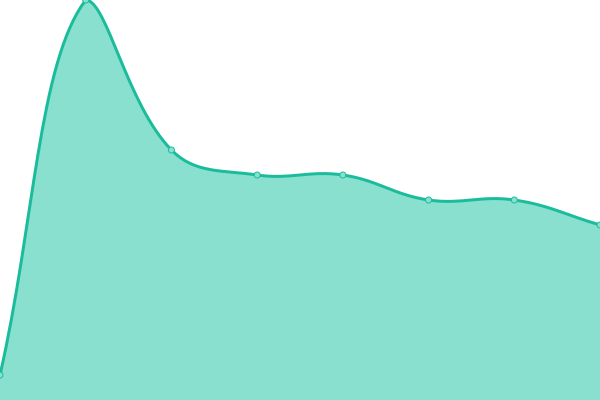

# [📈 Live Status](https://leoamaya.github.io/uptime-github-actions): <!--live status--> **🟥 Complete outage**

This repository contains the open-source uptime monitor and status page for [leoamaya](https://leoamaya.github.io/uptime-github-actions), powered by [Upptime](https://github.com/upptime/upptime).

With [Upptime](https://upptime.js.org), you can get your own unlimited and free uptime monitor and status page, powered entirely by a GitHub repository. We use [Issues](https://github.com/leoamaya/uptime-github-actions/issues) as incident reports, [Actions](https://github.com/leoamaya/uptime-github-actions/actions) as uptime monitors, and [Pages](https://leoamaya.github.io/uptime-github-actions) for the status page.

<!--start: status pages-->
<!-- This summary is generated by Upptime (https://github.com/upptime/upptime) -->
<!-- Do not edit this manually, your changes will be overwritten -->
<!-- prettier-ignore -->
| URL | Status | History | Response Time | Uptime |
| --- | ------ | ------- | ------------- | ------ |
|  [Vaulwarden](https://vault.amaya.net.ar) | 🟥 Down | [vaulwarden.yml](https://github.com/leoamaya/uptime-github-actions/commits/HEAD/history/vaulwarden.yml) | 

 154ms
     
 | 

<a href="https://leoamaya.github.io/uptime-github-actions/history/vaulwarden">0.00%</a>
    

|  [Anubis](https://vault.amaya.net.ar) | 🟥 Down | [anubis.yml](https://github.com/leoamaya/uptime-github-actions/commits/HEAD/history/anubis.yml) | 

 16ms
     
 | 

<a href="https://leoamaya.github.io/uptime-github-actions/history/anubis">0.00%</a>
    

|  [Osiris](https://osiris.amaya.net.ar) | 🟥 Down | [osiris.yml](https://github.com/leoamaya/uptime-github-actions/commits/HEAD/history/osiris.yml) | 

 146ms
     
 | 

<a href="https://leoamaya.github.io/uptime-github-actions/history/osiris">0.00%</a>
    

<!--end: status pages-->

[**Visit our status website →**](https://leoamaya.github.io/uptime-github-actions)

## 📄 License

- Powered by: [Upptime](https://github.com/upptime/upptime)
- Code: [MIT](./LICENSE) © [Anand Chowdhary](https://anandchowdhary.com), supported by [Pabio](https://pabio.com)
- Data in the `./history` directory: [Open Database License](https://opendatacommons.org/licenses/odbl/1-0/)
